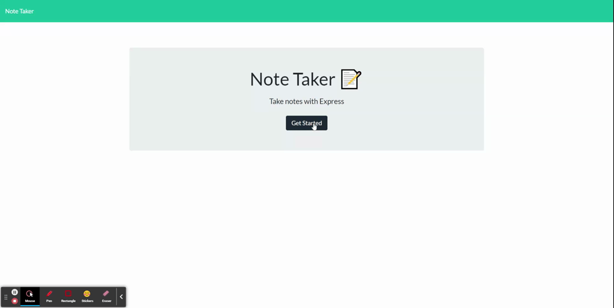

# Note Taker

## Description

This application can be used to write and save notes, access notes, and delete them. The application's front end was already developed with HTML, CSS and JavaScript, and I built the back end, connected it with the front end and deployed it in Heroku.

### GitHub Repository

https://github.com/ejpascualj/note-taker

### Deployed Application (Heroku)

https://note-taker-ejpascualj.herokuapp.com/

## Application Demo

video: https://drive.google.com/file/d/16422S8u0rU7un9hTE_E9YqjEfYt-Jm_F/view

## Development & Features

This application uses Node.js and Express.js for the creation of the server.
The Node modules used where uuid and fs. The application is deployed in Heroku.

## License

This project is licensed under MIT license.
